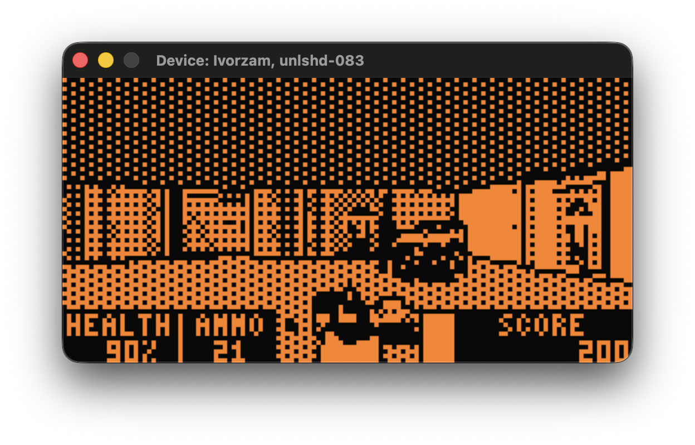

# FlipperToolkit

FlipperToolkit is a collection of simple utilities for interacting with **Flipper Zero** devices using Python.

## Installation

Clone the repository and set up the Python environment:

```bash
git clone https://github.com/apfxtech/FlipperToolkit.git
cd FlipperToolkit

python3 -m venv venv
source venv/bin/activate
```

Clone and install the Flipper Zero protobuf library:

```bash
git clone https://github.com/flipperdevices/flipperzero_protobuf_py.git
cd flipperzero_protobuf_py

pip install -r requirements.txt
pip install setuptools
python3 setup.py install
cd ..
```

## Usage

### GUI using pygame

Displays the Flipper Zero screen in a window rendered with pygame:

```bash
python3 flipper_cv.py
```

### GUI using OpenCV

Displays the screen using OpenCV. You can also provide a video file for playback:

```bash
python3 flipper_cv.py screen.mp4
```

## Screenshots



## License
This project is provided MIT license.